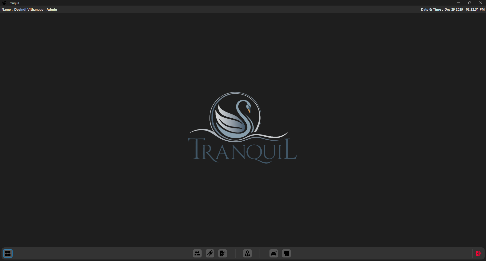

# Tranquil

Tranquil is a full-featured hotel room booking application developed using Java (Swing). The system is designed to manage hotel operations efficiently, including room bookings and management, customer management, employee management, payments, and report generation. It provides a user-friendly desktop interface suitable for hotel administrators and staff.

##  Key Features 📌

- 🔐 **Access Management :** Login and admin and staff role-based navigation.
- 👤 **Customer Management :** Customer registration and management.
- 🛏️ **Room Management :** Room booking and availability management.  
- 💳 **Payment Management :** Secure payment handling.
- 🧾 **Reports :** Report generation for customers details, employees details, room booking details, all payments and income reports using JasperReports.

## Technologies Used 🛠️

- **Language :** Java  
- **GUI Framework :** Java Swing  
- **IDE :** NetBeans  
- **Database :** MySQL  
- **Database Tool :** HeidiSQL, MySQL Workbench  
- **Reports :** JasperReports  

## Libraries 📦

- `commons-collections4-4.4.jar`
- `commons-digester-2.1.jar`
- `commons-logging-1.2.jar`
- `openpdf-1.3.30.jar`
- `swing-toast-notifications-1.0.3.jar`
- `flatlaf-3.4.1.jar`
- `flatlaf-extras-3.4.1.jar`
- `jsvg-1.4.0.jar`
- `Absolute Layout - AbsoluteLayout.jar`
- `jcalendar-1.4.jar`
- `mysql-connector-j-8.4.0.jar`
- `jasperreports-6.20.5.jar`

## Setup & Run Instructions ⚙️

- Clone or download the repository.
- Open the project in **NetBeans IDE**.  
- Import the provided MySQL database using **HeidiSQL**.
- Configure database credentials in: `MySQL.java`.
- Add required `.jar` files to the Libraries section.
- Run `WelcomeScreen.java` or `MainPanel.java`

## Project Objective 🎯

The goal of **Tranquil** is to provide a centralized and user-friendly hotel management system that improves efficiency, accuracy, and overall user experience for the administrator and hotel staff.

## Project Preview 👀

<table align="center">
  <tr>
    <td align="center">
       
      <b>Loading Page</b>
    </td>
    <td align="center">
       
      <b>Sign In Page</b>
    </td>
    <td align="center">
       
      <b>Home Page</b>
    </td>
  </tr>
</table>

To view all UI previews, please visit the 📁 [`preview_images`](./preview_images) folder.

